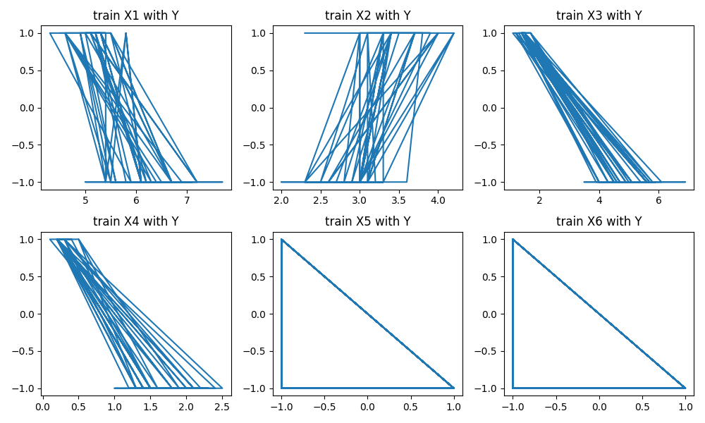
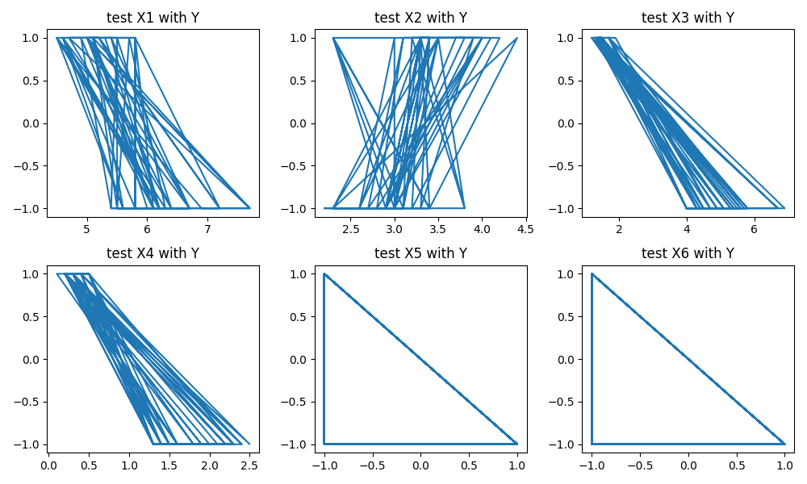
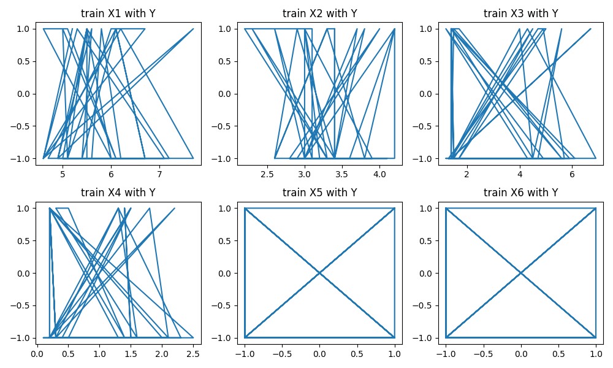
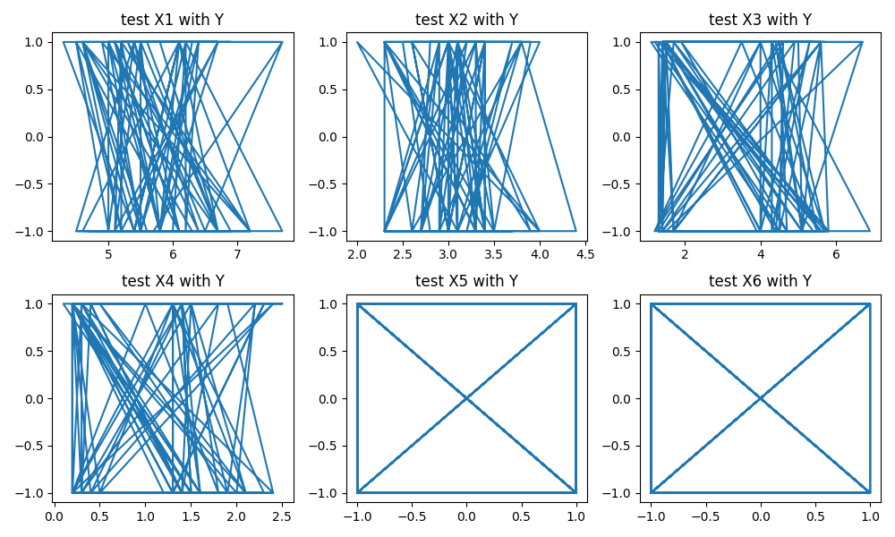

Para la realización de esta práctica se usaron las librerías:
•	pandas
•	matplotlib
•	numpy

## Particionado secuencial

Para el primer método de partición decidí usar una función generadora que recibiera una tupla con los porcentajes de cada una de las particiones y los conjuntos la cual retorna un iterador con los subconjuntos.

Antes comenzar con la partición se valida que la suma de los porcentajes de las particiones sea 100 y que el largo de X y Y sea el mismo.
Una vez validado, se establece como punto de partida el cero después se itera sobre las particiones generando los pasos para cada partición con los cuales se obtienen el índice de inicio y final y se van produciendo los subconjuntos.

```python
def split_sequencial (partitions: tuple[int, ...], X = np.array, Y = np.array):
  validate(partitions, X, Y)

  length = X.shape[0]
  start_index = 0
  for partition in partitions:
    step = round(partition / 100 * length)
    end_index = start_index + step
    yield X[start_index:end_index]
    yield Y[start_index:end_index]
    start_index = end_index
    start_index = end_index

X_train, Y_train, X_test, Y_test = split_sequencial((51, 49), X, Y)
```

Al particionar de forma secuencial es muy sencillo programarlo con un ciclo con el cuál ir produciendo los resultados.
<details>
<summary>Gráficas de particionado secuencial</summary>





</details>
## Particionado aleatorio

Este método recibe los mismos parámetros y da el resultado de la misma forma que el método anterior porque internamente hace uso de este. La diferencia es que antes de llamarlo mezcla los conjuntos de X e Y de forma aleatoria haciendo que, aunque la partición sea secuencial los conjuntos sean aleatorios. Lo cual resulta útil si se requiere realizar varios entrenamientos y pruebas del modelo para ver cual da mejores resultados.

```python
def split_shuffle (partitions: tuple[int, ...], X = np.array, Y = np.array):
  X, Y = X.copy(), Y.copy()
  np.random.shuffle(X)
  np.random.shuffle(Y)
  return split_sequencial(partitions, X, Y)

X_train, Y_train, X_test, Y_test = split_shuffle((31, 69), X, Y)
```

<details>
<summary>Gráficas de particionado aleatorio</summary>





</details>
